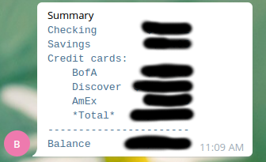

# DIY Bank balance aggregation

I like to know what my credit card balance is.
And I don't want to visit all online bank accounts every day.
So I automated this process.
In a secure and reusable way.

I built my solution on top of [Kibitzr](https://kibitzr.github.io/) - self-hosted web scrapper.
It logs in to online bank accounts and extract balances.
Kibitzr has a [curated snippets collection](https://github.com/kibitzr/recipes/tree/master/banks).
So I picked the snippets for my banks and mashed them into one file:


```yaml
checks:

  - name: BofA
    url: https://www.bankofamerica.com/
    form:
      - id: onlineId1
        creds: keyring.bofa.username
      - id: passcode1
        creds: keyring.bofa.password
      - id: hp-sign-in-btn
        click: true
    delay: 5
    transform:
      - css-all: .balanceValue
      - text
    notify:
      - stash:
          bofa_checking: "{{ lines.0 }}"
          bofa_savings: "{{ lines.1 }}"
          bofa_credit: "{{ lines.2 }}"
    period: 3 hours

  - name: Discover
    url: https://www.discover.com/
    form:
      - id: userid
        creds: keyring.discover.username
      - id: password
        creds: keyring.discover.password
    delay: 5
    transform:
        - css: .current-balance
        - text
    notify:
      - stash:
          discover: "${{ content }}"
    period: 3h

  - name: AmEx
    url: https://global.americanexpress.com/dashboard
    form:
        - id: lilo_userName
          creds: keyring.amex.username
        - id: lilo_password
          creds: keyring.amex.password
        - id: lilo_formSubmit
          click: true
    delay: 10
    transform:
        - xpath: '//*[@id="root"]/div[1]//section//li[2]/div/div[2]/span'
        - text
    notify:
      - stash:
          amex: "{{ content }}"
    period: 3h

  - name: Summary
    script: echo dummy
    transform:
      - jinja: |
          
          
          
          
          
          
          
          ```text
          Checking     {{ '%10s' % stash.bofa_checking }}
          Savings      {{ '%10s' % stash.bofa_savings }}
          Credit cards:
              BofA     {{ '%10s' % stash.bofa_credit }}
              Discover {{ '%10s' % stash.discover }}
              AmEx     {{ '%10s' % stash.amex }}
              *Total*  {{ '%10s' % credits | dollars }}
          -----------------------
          Balance      {{ '%10s' % total | dollars }}
          ```
      - changes: new
    notify:
      - telegram
    period: 3 hours
```

Let me explain how it works.
There are 3 scrapping checks defined in this file: BofA, Discover, AmEx.
Each check open one bank account, scrapes balance value, and saves it to stash.
Stash is a Kibitzr's persistent key-value storage.
In other words, it's a place where you can put data for later use.

Fourth check does aggregation of all balances into one template and sends it
to my Telegram account. (Actually it sends it to me and my wife private group).

All scrapping checks are alike, so I will break down the first one.

1. Check declares it's name:
   ```yaml
   - name: BofA
   ```
2. Opens Firefox browser to open bank's home page:
   ```yaml
     url: https://www.bankofamerica.com/
   ```
3. Fills the form picking values from secure Operating System's keyring:
   ```yaml
     form:
       - id: onlineId1
         creds: keyring.bofa.username
       - id: passcode1
         creds: keyring.bofa.password
       - id: hp-sign-in-btn
         click: true
   ```
4. Waits for 5 seconds to let the dynamic dashboard load:
   ```yaml
     delay: 5
   ```
5. Extracts text from all HTML elements having CSS class `.balanceValue` assigned.
   ```yaml
     transform:
       - css-all: .balanceValue
       - text
   ```
6. I have 3 accounts in Bank of America: checking, savings and credit.
   They always go in this order, so I stash their values under corresponding keys:
   ```yaml
     notify:
       - stash:
           bofa_checking: "{{ lines.0 }}"
           bofa_savings: "{{ lines.1 }}"
           bofa_credit: "{{ lines.2 }}"
   ```
7. This task runs every 3 hours:
   ```yaml
     period: 3 hours
   ```

Other 2 scrapping checks do the same thing for other banks.
After their execution I have all the data I need to create a report:

1. I called aggregation check Summary:
   ```yaml
   - name: Summary
   ```
2. It uses dummy bash fetcher. Because Kibitzr requires something to act as a fetcher.
   ```yaml
     script: echo dummy
   ```
3. All the heavy lifting is done inside Jinja template.
   It looks scary at first sight. But on closer look it's simple assigning and arithmetics.
   ```yaml
     transform:
       - jinja: |
           
           
           
           
           
           
           
           ```text
           Checking     {{ '%10s' % stash.bofa_checking }}
           Savings      {{ '%10s' % stash.bofa_savings }}
           Credit cards:
               BofA     {{ '%10s' % stash.bofa_credit }}
               Discover {{ '%10s' % stash.discover }}
               AmEx     {{ '%10s' % stash.amex }}
               *Total*  {{ '%10s' % credits | dollars }}
           -----------------------
           Balance      {{ '%10s' % total | dollars }}
           ```
       - changes: new
   ```
4. Finally, Kibitzr sends shiny report through Telegram:
   ```yaml
     notify:
       - telegram
   ```

Then I saved my telegram bot credentials in `kibitzr-creds.yml`:

```yaml
telegram:
    token: 341530401:AABCRg_snz1554qkslIS8tMnNfWT3p5P80X
    chat: 926461341
```

I can't say that I composed whole thing from the first attempt.
But after some tweaking and poking I've got working configuration,
that sends me norifications like this one:


