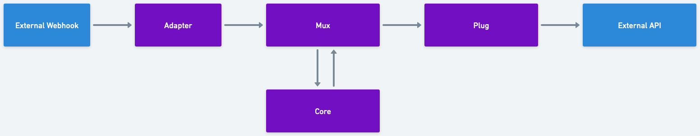

Making GraphViz look like Whimsical
-----------------------------------

I'm fond of Whimsical look and feel, and I like how GraphViz can render nice flow charts from simple textual description.

So here's my attempt to make a simple GraphViz digraph render as if it was built in Whimsical.

.. code-block::

    digraph {
        edge [color="#808080", arrowsize=.6, penwidth=3, minlen=3];
        node [shape=box, fontname="DIN Next, sans-serif", style="rounded,filled", penwidth=5, fillcolor="#8010d0", color="#f0f0f0", fontcolor=white,  margin="0.35" fontweight=bold]
        bgcolor="#f0f0f0";

        {rank=same; "External Webhook" -> "Adapter" -> Mux -> Plug -> "External API"}
        Core -> Mux -> Core [minlen=1]

        "Slack API", "External Webhook" [fillcolor="#4040ff"]
    }

Output (auto-generated by ``sphinx.ext.graphviz``):

.. digraph:: services

    edge [color="#808080", arrowsize=.6, penwidth=3, minlen=3];
    node [shape=box, fontname="DIN Next, sans-serif", style="rounded,filled", penwidth=5, fillcolor="#8010d0", color="#f0f0f0", fontcolor=white,  margin="0.35" fontweight=bold]
    bgcolor="#f0f0f0";
    {rank=same; "External Webhook" -> "Adapter" -> Mux -> Plug -> "External API"}
    Core -> Mux -> Core [minlen=1]
    "External API", "External Webhook" [fillcolor="#4040ff"]

Same flowchart rendered in Whimsical for comparison:

